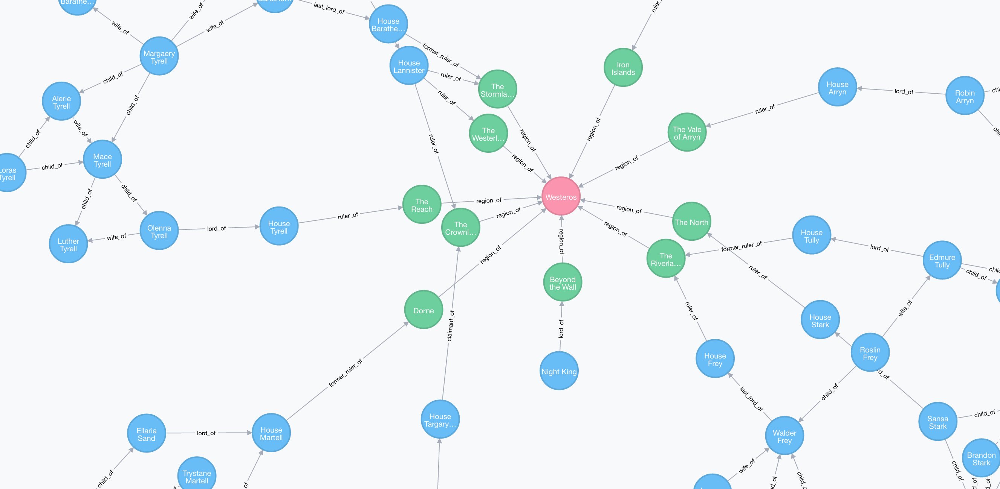

# Game of Thrones Interactive Family Tree

This application is an interactive family tree for the TV show Game of Thrones.
It was inspired by [this website](http://lab.rtve.es/serie-isabel/personajes/),
a visual display of characters from another TV show.

My application turned out a bit different as I started exploring graph
databases and data visualisation.

Unfortunately, you must use the [Chrome 'Allow-Control-Allow-Origin'](https://chrome.google.com/webstore/detail/allow-control-allow-origi/nlfbmbojpeacfghkpbjhddihlkkiljbi?hl=en)
add-on for the third-party API calls to work (double click on a node and you
will see what I mean). If anyone knows a work-around, please contact me.

## How to Use

1. Clone or download this repository, as well as [this repository](https://github.com/lukephelan/api-wow).
2. Run `npm install` in your terminal at the root directory of each project
3. Download Neo4j and select a database location somewhere locally
4. Set a username and password for your database and append your own username
 and password in /api/app.js/ where it connects to the database
 `db = new neo4j('http://<username>:<password>@localhost:7474');`
5. Follow Neo4j's link to the browser interface
6. Copy and paste the code from [got-tree]('/api/seed') into the command line to
 seed the database
7. Run two local servers from your terminal for both app.js files
8. Head to the localhost root directory for the front-end server
9. Check the back-end API at the hosted port with a /json extension to check
that it is sending JSON data
10. Application should be up and running

## Choosing Technology

### Database for Genealogy

Initially I intended to create the application on the MEAN stack,
utilising MongoDB as the database. I did a quick search for creating a
genealogy database with MongoDB and NoSQL in general, and came across the
following [slideshow](http://www.slideshare.net/spf13/mongodb-for-genealogy) discussing how one can use MongoDB for this purpose.

At first it may seem that a traditional relational database like SQL would make
the most sense for genealogy given the inherent nature of the relationships,
however as shown in the above slideshow, family trees are a lot more
unconventional than they first appear.

For example, people change their names, birth dates can be unclear,
relationships change over time, people adopt children and have illegitimate
children, and in the case of Game of Thrones, people can be resurrected! A
NoSQL database allows more flexibility in the nature of the data that you would
store for an individual.

Pretty quickly however I came across the [graph database](https://en.wikipedia.org/wiki/Graph_database),
specifically, [Neo4j](https://neo4j.com/).

I spent an afternoon playing around with Neo4j and after spending a few hours
away from the computer I couldn't stop thinking about how perfect it was for
my application, and how little sense it made for me to use anything else.

If you need a database that relies heavily on relationships and needs the
flexibility of NoSQL, I would recommend checking it out. But I wouldn't try to
use it unless it makes more sense than any of the alternatives. Don't bend it
to your use case.

The best part is that Neo4j comes with a browser interface which graphically
displays your data.



### Visualisation

Of course, upon seeing this amazing visualisation - one in which you can click
nodes, drag them around and watch them wobble - I wanted the same for my
application. The problem is, there is no easy (i.e. built-in) way to do this.
One option is to look at the source code for Neo4j but unfortunately I am not
quite there yet and would really struggle with customisation. Besides, I really
don't want to breach any copyright laws.

So I instead went through the list of [technology recommended by Neo4j](https://neo4j.com/developer/guide-data-visualization/)
and played around with a few tools and looked at how a few other people on the
web had displayed their data.

At first I decided to use [Sigma.js](http://sigmajs.org/). It comes with preset
plug-ins and a bunch of examples with which to work with, one of which works
with Neo4j data. Unfortunately, it was also the plainest of all the
examples. Therefore, I had to dig in to the code to customise it to my will.

I managed to get the Sigma.js visualisation to work, but ultimately I was
unsatisfied with the look. Sigma.js would be great for visualising very, very
large datasets. But my dataset is nowhere near that large, and I wanted to
display character's faces on the nodes.

I kept thinking about [D3.js](https://d3js.org/) and how fantastic all their
examples of data visualisation look. I looked through a few tutorials and found
that it required a lot less code. It also felt a lot cleaner to use as you could
import all D3.js functionality with one CDN.

The best tutorial I found was [this one](http://www.coppelia.io/2014/07/an-a-to-z-of-extra-features-for-the-d3-force-layout/).
It allowed me to pick and choose what I wanted to include in my code. At the end
of the day it wasn't just copying the tutorial. I had to go through and understand
how everything worked because my data-set was different, and no two tutorials
set their code up the same way.

For the record, this is a [force-directed graph drawing](https://en.wikipedia.org/wiki/Force-directed_graph_drawing).

### The Game of Thrones Wikia API

I wanted to get my extended information from the [Game of Thrones Wikia
API](http://gameofthrones.wikia.com/wiki/Game_of_Thrones_Wiki).

An example of a query on information about Jon Snow:

http://gameofthrones.wikia.com/api/v1/Articles/AsSimpleJson?id=2123

Unfortunately, this API does not seem to have CORS enabled, which is a strange
thing for an API. Unless I am doing something wrong...

## Neo4j to D3.js

Luckily for me, someone had [already created](http://www.knowstack.com/game-of-thrones-family-graph-using-neo4j/)
a seed file for Game of Thrones and Neo4j. I used this as a starting point to
test out the application.

The Node.js module I used to talk to the Neo4j database was ['node-neo4j'](https://github.com/philippkueng/node-neo4j).

The JSON object received from the database meant that I needed to run two
queries and join them together in one object in a format that my D3.js code
could use.

```javascript
// Create an object to store the database results
var object = {};

app.get('/json', function (req, res){

    // Retrieve all nodes from the database
    db.cypherQuery("START N=NODE(*) RETURN {name: N.name, group: N.group, img: N.img}", function(err, result){
        if(err) throw err;
        object.nodes = result.data;

        // Retrieve all relationships from the database
        db.cypherQuery("START n=node(*) MATCH (n)-[r]->(m) RETURN {source: id(n), target: id(m), value: r.value}", function(err, result){
            if(err) throw err;
            object.links = result.data
            // Send the object as a response
            res.send(object);
        });
    });
});
```

## Problems and Other Growing Pains

### Learning Neo4j

I spent a few hours on Neo4j without ever having even heard of a graph database.
I initially thought it would be foolish to try it out considering I had one week
to get the application finished. It was a few frustrating hours, but once I
stepped away for a while it made more sense to give it a shot. Once you figure
out how to seed and run queries, it's really not that hard after all.

If you want to use a database that relies on a lot of complicated relationships
(refer to Neo4j's [examples](https://neo4j.com/use-cases/)), I would
recommend Neo4j.

### Querying the Database

There are plenty of D3.js examples/tutorials online, just as there are enough
Neo4j examples/tutorials, but there aren't a whole lot of combined tutorials.
At the end of the day, it is simply a Node.js application using the REST API
of Neo4j. It's just a matter of formatting your seed data and queries in a way
that allow you to easily pass that data into d3.js.

It seems simple in retrospect, but this took many hours to configure.

### The Undefined Object That Was Defined (But Not Really)

I came across a really peculiar thing that just made no logical sense to me or
anyone else I showed.

The way the queries are set up, it should return a JSON object with two keys -
nodes and links. Nodes being things like the information of a character, and
links being information on the relationship between two nodes. The data for
each key is an array of objects. So each element in the 'Node' array contains
an object with key value pairs, with information such as character name, and
a URL to their image at the Game of Thrones Wiki.

The strange thing that happened, is that the first element of the 'Links' array
would create an error and put the brakes on the graphing script because
it said that the values were undefined. If I went directly to the API URL
in my browser the JSON is rendered to the page, and it showed data. All good.


However, when I ran a console.log on the front-end, it showed that, sure enough,
the source and target of the first element of the Links array were undefined.

The really peculiar part was that if I changed the console.log to display only
that element in the array, it suddenly was no longer undefined and logged
the correct data!

I have a theory for this. I fixed it by deleting the database and creating a
new one. Previously I had only deleted the data. I believe that unlike other
databases like MongoDB and Postgres, Neo4j is happy to use an ID again once the
ID has been deleted. I believe that when I deleted and then re-seeded the
database, the ID of the Nodes would reset, and the relationships were losing
a link to the proper Node ID's. I would need to have a closer look at the
Neo4j documentation, but for now the problem is solved by deleting the database
and starting again.

I believe Neo4j's approach to ID's is that the user is expected to create their
own unique ID's upon creating data. Something to keep in mind.

### Click and Drag

Given the size of the visualisation, in order to prevent the display from
clustering, I wanted to implement the ability to zoom and pan. I followed
examples online such as [this one](http://jsfiddle.net/nrabinowitz/QMKm3/). In
this example you will notice that when you click and hold on the background,
you can pan the graph. However, when you click on a node and drag, only the node
moves. This would not work for me. Instead, when clicking and dragging the node
the entire graph pans (the node also moves slightly).

Finally, I discovered that I wasn't doing anything specific wrong, rather, I
was using a different version of D3.js than in the examples I was finding. It
turns out that D3.js changed the handling of drag gestures in version 3. See
[this Stack Overflow question](http://stackoverflow.com/questions/17953106/why-does-d3-js-v3-break-my-force-graph-when-implementing-zooming-when-v2-doesnt)
for an explanation.

### Cross-Origin Issues

#### HTTPS and HTTP

Heroku is served on a secure protocol, i.e. HTTPS. The application does not
like mixed content and will complain if you attempt to request content from
a regular HTTP page. This can easily be overcome simply by adding the 'S' in
your code.

#### Cross-Origin Requests

[Cross-origin HTTP requests](https://developer.mozilla.org/en-US/docs/Web/HTTP/Access_control_CORS)
are better explained elsewhere. Essentially, unless a third-party API has been
set-up to allow for cross-origin requests, there is not much you can do about
it from the client side.

I have not found a workaround for this issue other than to use the
[Chrome 'Allow-Control-Allow-Origin](https://chrome.google.com/webstore/detail/allow-control-allow-origi/nlfbmbojpeacfghkpbjhddihlkkiljbi?hl=en)
add-on. This is OK for me, but not so great for people who want to use the
application. Another workaround may be to upload the data into the database so
that I am not reliant on any third-party API. The disadvantages are that it will
take me a lot of time to do and the data won't remain up-to-date.
